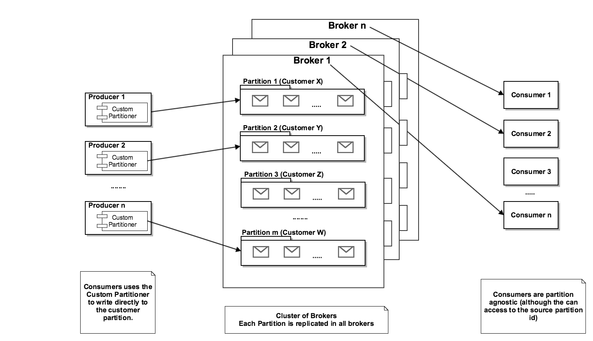

= Haufe Kafka Partitioner PoC

This projects provides an example of how using kafka partitions as a routing mechanism, creating this way a phisical multitenant usage of a kafka cluster.
In this project you will find several times the word DataSet, which reefers at the data set related to a given customer.

In order to link a partition with it's customer, or dataSet, a configuration message is created as a log message in a dedicated topic (which is not partitioned,) that works as a traversal configuration topic for all the cluster.
These messages are created dynamically any time a new dataSet arrives to the application, and is stored in order to be retrieved lately using
an Event Sourcing approach where the Event Store is the Kafka itself.

== Execution

In order to be able to execute the integration tests existing in the project, you will need to have active a real kafka and zookeeper service.
If you don't have an already existing installation, you can use the https://github.com/spotify/docker-kafka[spotify docker container] this way:

[source,bash]
----
docker run -p 2181:2181 -p 9092:9092 --env ADVERTISED_HOST=`docker-machine ip \`docker-machine active\`` --env ADVERTISED_PORT=9092 spotify/kafka
----
[%hardbreaks]

If you don't have docker-machine in your system you can always:

[source,bash]
----
docker run -d -p 2181:2181 -p 9092:9092 --env ADVERTISED_HOST=`[your ip here]` --env ADVERTISED_PORT=9092 spotify/kafka
----
[%hardbreaks]

or the related windows commands....

== Tests

This PoC proves the usage of Kafka to solve the following requirements:

=== Partition based data segregation:
In order to have a real multitenant application, where messages from different customers are physically segregated, and therefore not located into the same file location,
this PoC presents a way to do that using as a key element the partitioning feature present in Kafka.

Running the spring test `PartitionerTest` 5 different messages will be sent to different partitions. These partitions will be automatically created on demand.
A partition will be assigned for each customer but the consumer will be not aware of such separation.
